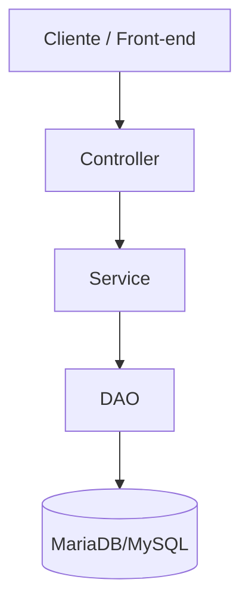

# 🌐 Sys_lab — Sistema de Reserva de Laboratórios


<!-- ALL-CONTRIBUTORS-BADGE:START - Do not remove or modify this section -->
[](#contributors-)
<!-- ALL-CONTRIBUTORS-BADGE:END -->

O **Sys_lab** é um sistema para **reserva e gerenciamento de laboratórios**, desenvolvido como projeto de Extensão acadêmica.  
Gerencie salas, reservas, professores e usuários de forma simples e organizada.

---

## ⭐ Contribuidores do GitHub

Agradecimentos a todos que contribuíram para o projeto!

<table>
  <tbody>
    <tr>
      <!-- Isaque -->
      <td align="center" width="20%">
        <a href="https://github.com/isaqxd">
          
          <br />
          <sub><b>Isaque Costa</b></sub>
        </a>
        <br />
        <a href="https://www.linkedin.com/in/isaqxd">
          
        </a>
      </td>
      <!-- Luis Eduardo -->
      <td align="center" width="20%">
        <a href="https://github.com/sunshasdev">
          
          <br />
          <sub><b>Luis Eduardo</b></sub>
        </a>
        <br />
        <a href="https://www.linkedin.com/in/luis-eduardo-oliveira-maia-464389324/">
          
        </a>
      </td>
      <!-- Luiz Gustavo -->
      <td align="center" width="20%">
        <a href="https://github.com/gusta-xis">
          
          <br />
          <sub><b>Luiz Gustavo</b></sub>
        </a>
        <br />
        <a href="https://www.linkedin.com/in/devdamascena/">
          
        </a>
      </td>
      <!-- Lucas Gabriel -->
      <td align="center" width="20%">
        <a href="https://github.com/devlucasl">
          
          <br />
          <sub><b>Lucas Gabriel</b></sub>
        </a>
        <br />
        <a href="https://www.linkedin.com/in/lucasgcss/">
          
        </a>
      </td>
    </tr>
  </tbody>
</table>

---

## ✨ Funcionalidades

- Cadastro de **Usuários**, **Professores**, **Salas** e **Reservas**
- Painel com:
  - Reservas atuais
  - Futuras
  - Passadas
  - Canceladas
- Autenticação básica
- API REST organizada por recursos
- Arquitetura modular (Controller → Service → DAO)

---

# 🛠 Tecnologias

## 🚀 Back-end


---

## 🎨 Front-end


---

## 🗄️ Banco de Dados


- Tabelas principais: **Usuários**, **Professores**, **Salas**, **Reservas**, **Horários**
- Relacionamentos via **chaves estrangeiras**
- Índices para otimizar consultas

---

## 🧱 Arquitetura


### Organização
- **Controllers** — entrada das requisições  
- **Services** — regras de negócio  
- **DAOs** — persistência em MariaDB/MySQL

### Fluxo


## 🤝 Como contribuir

Contribuições são super bem-vindas!  

1. Faça um **fork**  
2. Crie uma branch:
    ```bash
    git checkout -b minha-melhoria
    ```
3. Faça suas alterações e commit:
    ```bash
    git commit -m "feat: minha melhoria"
    ```
4. Envie a branch:
    ```bash 
    git push origin minha-melhoria
    ```
5. Abra um Pull Request ❤️

---
